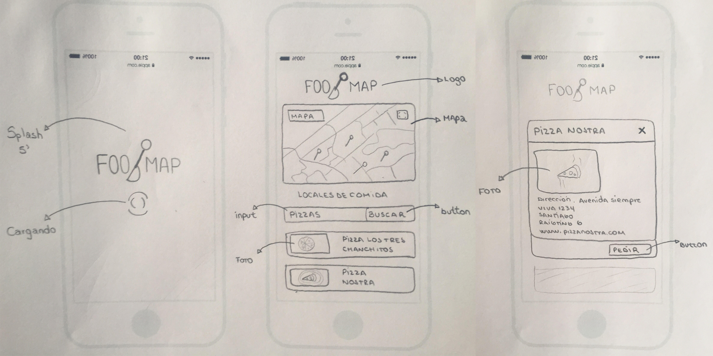
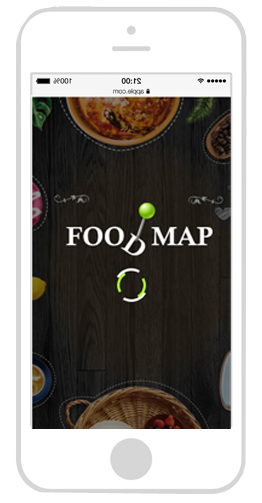
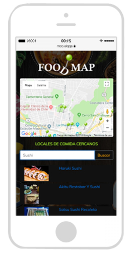
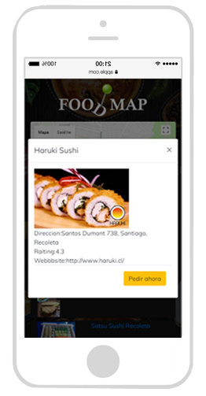

#  F O O D M A P

FOODMAP es una web-app que a través de un input puedes filtrar los restaurantes
que se encuentran cerca de ti, de forma dinámica muestra tu ubicación en el mapa y todos los locales comerciales de comida cercanos, puedes filtrar según tu criterio de búsqueda y acceder a la información de cada uno de ellos, obteniendo nombre, dirección, raigtin, página web, cada uno de estos datos será mostrado si están disponibles en la API de Google.

Para acceder a la página, haz click [aquí.](https://mloretto.github.io/scl-2018-01-foodmap)

#### Planificación Proyecto.

La Organización puede ser revisada en este link.
(https://trello.com/b/6ah2a2SP/foodmap)

#### Prototipo de baja fidelidad.

A continuación se muestra el prototipo de baja fidelidad de la web-app.

 

#### Prototipo de alta fidelidad.

En la vista principal se muestran todos los restaurantes "cerca de ti" junto
con el input para filtrar tu elección.

Una vez que la elección del filtro fue realizada de muestran únicamente aquellos
restaurantes que cumplen con tu condición de búsqueda.

Al seleccionar alguno de los restaurantes, muestra la información de
este a través de un modal. Una vez cerrado el modal vuelve a la vista principal.

